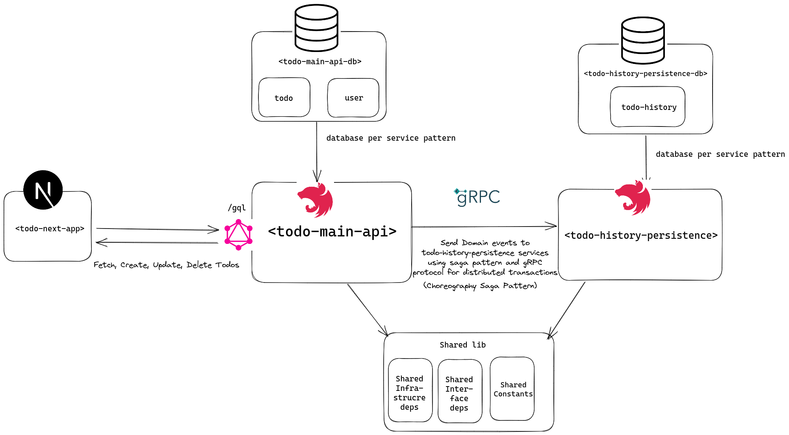

# Over Engineered Todo Microservices
## System Architecture

The Todo app is built using a microservices architecture, with each service following the Domain-Driven Design (DDD) approach and the Command Query Responsibility Segregation (CQRS) pattern.

### Microservices Approach:
The microservices approach is used to break down the application into smaller, independent services (`todo-main-api `& `todo-history-persistence`)that can be developed, deployed, and scaled separately. This approach allows for better separation of concerns, improved agility, and easier maintenance.

### Todo-Main-API Service:
The `todo-main-api` service is responsible for handling client requests and performing CRUD operations for Todo entities. It also handles user seeding. This service is built using the DDD approach, which involves breaking down the service into domains, each of which has its own infrastructre, commands, queries, event handlers, and interface layer.

### Todo-History-Persistence Service:
The `todo-history-persistence` service is responsible for persisting updates made to Todo entities by the `todo-main-api` service. This service is also built using the DDD approach.

### Database Per Service Approach:
The database per service approach is used to isolate each service's data from other services. This approach allows for better scalability and flexibility, as each service can use the database technology that best suits its needs. I used mysql database for both of the services for simplicty.

### Choreography Saga Pattern:
The Choreography Saga pattern is used to handle distributed transactions between the `todo-main-api` and `todo-history-persistence` services. This pattern uses gRPC protocol to exchange messages between the services and ensure that the transactions are performed atomically.


### Monorepo Approach:
The Monorepo approach is used to manage the project's codebase, with shared infrastructure, interface layers, dependencies, and shared constants. This approach allows for better code sharing and easier maintenance, as changes made to shared code are reflected across all services that use it.

## How to Run:
- Create `.env` files for each microservice and copy the content of `.env.example` to it
- Spin up application containers by running
```shell
docker-compose up
```

**User seeding**:
To seed 10 users, run this mutation:
```graphql
mutation seedUsers{
    seedUsers(seedUsersInput: {numberOfUsers: 10}){
        message
    }
}
```


